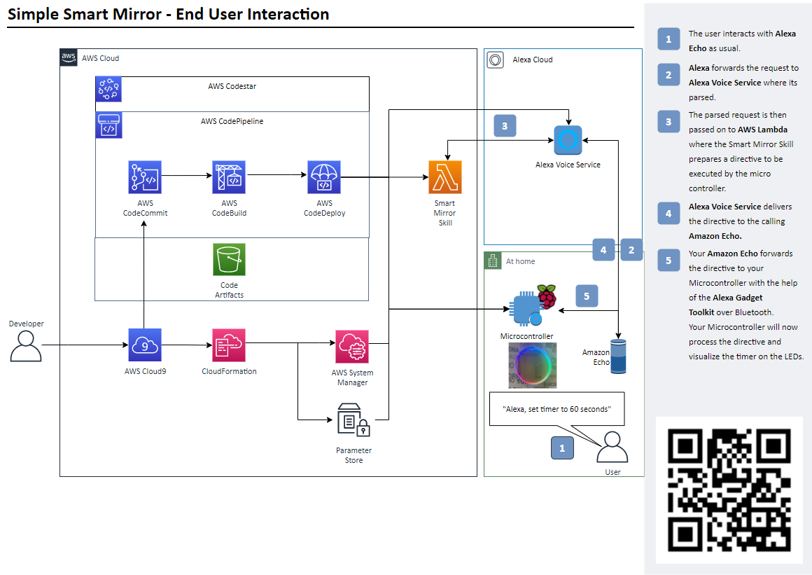

# The Simple Smart Mirror Project - AWS Builders Fair 2021 

## The Simple Smart Mirror Architecture

Link to smart mirror [Deployment](docs/images/smart-mirror-architecture-deploy-changes.png) flow

Link to smart mirror [Provision and Management](docs/images/smart-mirror-architecture-provision-manage.png) flow

## The Simple Smart Mirror

“The Simple Smart Mirror” is an Alexa voice controlled programmable LED strip with additional smarts: made by builders for builders and their kids. It is _NOT_ just a typical mirror with LED’s. The Simple Smart Mirror is integrated with AWS CI/CD pipeline and serverless backend, including management of Raspberry Pi in your home network. 
The project focuses on a learning experience - something a parents can do with their kids.

The Simple Smart Mirror project can be divided in four high level categories:
   1. Hardware and electronics 
      
      Raspberry Pi, Adafruit Neopixel LED Strip, Amazon Echo 
   2. AWS Services - serverless back-end with full blown CI/CD pipeline: 
      
      AWS: CodeCommit, CodeDeploy, CodePipeline, CodeStar, Cloud9 IDE (EC2+EBS), CloudFormation, Systems Manager, Lambda and S3
   3. Alexa Gadget and Alexa Skills as an interface to control the hardware
   4. Learning and experiment platform - with basic infrastructure set up you can easily experiment and add new functionality. Take our guided challenges to get you started 

Under the hood the Smart Mirror works like this: Code is updated in repository - committed changes trigger the CI/CD pipeline to deploy to Alexa Cloud, Alexa Skill, and the Gadget (Raspberry Pi). On top of this there is automatic provisioning of the Alexa Gadget (Raspberry Pi) and dependencies using AWS Systems Manager.

The main user interaction happens between the Echo Device and the user, where commands are sent over bluetooth to the Alexa Gadget (Raspberry Pi). 

To make this truly an learning experience we do not hand you the full solution, but provide guided challenges. These challenges will help you to add or customize existing functionality for example invocation word, clock function or timer.

## Repository structure

| Folder | Purpose | 
| --- | ---
| /docs/   | Project Documentation |
| /cloudformation-templates/ | Deployment templates for Simple Smart Mirror components|
| /smart-mirror-mvp/ | Smart Mirror Sample Package to download/extract in your CodeCommit repo to start experimenting with challenges |
| /smart-mirror-full/ | Smart Mirror with full functionality (zip and extract): clock, timer, police lights, rainbow, color of your choice, mirror mirror on the wall... |

## Getting Started 

It is as easy as 1, 2, 3. Follow the step below to set up the hardware and required AWS infrastructure.

`1st` [Pre-requisites and shopping lists](docs/SMARTREQ.md) 

`2nd` Provision Raspberry Pi and set up hardware, see [Raspberry Pi OS, HW and electronics installation](docs/SMARTHW.md)

`3rd` Deploy AWS services and Alexa skill, see [AWS Cloud Services and Alexa deployment](docs/SMARTMIRROR.md)

Next proceed to our coding challenges and add functionality to your smart mirror.

## Challenges

Please follow [Perform Challenges](docs/CHALLENGES.md) to start adding functionality to your smart mirror with step by step instructions.

## How it works and how to troubleshoot
See [How Smart Mirror works](docs/HOW_IT_WORKS.md) for additional information about how smart mirror and intents work and also how to troubleshoot.   

## License

This library is licensed ASL. See [LICENSE](LICENSE) file.

