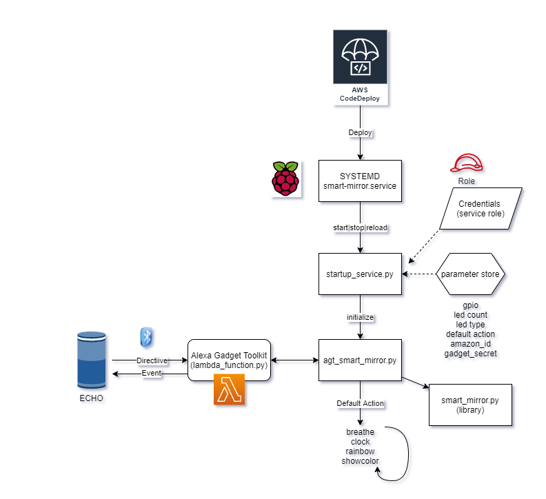

# How Smart Mirror Works

Table of contents:
<!-- AUTO-GENERATED-CONTENT:START (TOC) -->
- [Developing new capabilities and intents](#developing-new-capabilities-and-intents)
  - [Steps](#steps)
- [Develop new capabilities of the skill](#develop-new-capabilities-of-the-skill)
  - [While developing](#while-developing)
  - [Best practice for LED control code](#best-practice-for-led-control-code)
- [Integrate the method with the "Alexa Gadget"-service (smart-mirror service)](#integrate-the-method-with-the-alexa-gadget-service-smart-mirror-service)
  - [Define an Action](#define-an-action)
  - [Define a directive handler to trigger the ```startAction```](#define-a-directive-handler-to-trigger-the-startaction)
  - [Add (and call) the LED control code method you implemented in `smart_mirror.py`](#add-and-call-the-led-control-code-method-you-implemented-in-smart_mirrorpy)
- [Implement Lambda handler for the intent](#implement-lambda-handler-for-the-intent)
  - [Create an Alexa intent that will trigger the Lambda handler](#create-an-alexa-intent-that-will-trigger-the-lambda-handler)
- [Smart Mirror Raspberry Pi service overview](#smart-mirror-raspberry-pi-service-overview)
  - [Raspberry Pi Smart Mirror file and folder structure](#raspberry-pi-smart-mirror-file-and-folder-structure)
- [Debugging and troubleshooting instructions](#debugging-and-troubleshooting-instructions)
  - [Smart Mirror Service debug](#smart-mirror-service-debug)
  - [Alexa gadget BT re-registration](#alexa-gadget-bt-re-registration)
  - [Re-imaging your raspberry PI or adding another Smart Mirror to your pipeline](#re-imaging-your-raspberry-pi-or-adding-another-smart-mirror-to-your-pipeline)
- [Clean up of Smart Mirror AWS Infrastructure and services](#clean-up-of-smart-mirror-aws-infrastructure-and-services)
<!-- AUTO-GENERATED-CONTENT:END -->

## Developing new capabilities and intents

How you develop new capabilities depends on complexity of your ideas which in turn is limitless and part of the learning experience. As part of this instruction we will focus on ideas that will use LED strip as primary output to simplify the first steps.

We assume that you are at a stage where you have followed the setup instructions to set up and connect your raspberry pi with LED strip and paired it with your Echo device and you can successfully run supplied demo intents like "rainbow" or "help". (Saying: "Alexa, unicorn", followed by intent like "help"), and have your code deploy/star-project set up.

If you are not at that stage use setup instructions from README.md to set your environment.

Following instructions are just a simple ideas to get you started, but the point forward is to experiment as you learn. There is no "right way" to do this.

### Steps

1. First step in developing new capabilities of the skill is to create the code that will control the LED strip on the Raspberry Pi.
2. Second step is to call that code from the "Alexa Gadget" service on Raspberry Pi. This is the glue between the Alexa-skill intent (a command) and the LED control code. 
3. Third step is to implement Lambda handler for the intent
4. Fourth step is to create an Alexa intent that will trigger the Lambda handler

## Develop new capabilities of the skill

LED is essentially controlled by the smart-mirror service on the Raspberry Pi. The code for service is located in Git repo:```device/startup/script```.

Main components to control the LED are ```agt_smart_mirror.py``` (the service core) and ```smart_mirror.py``` (LED control implementation).

To control the LED in ```smart_mirror.py``` we use Neopixel library. In the file you will find some convenience methods that you can use during your own implementation, such as:
```reset()``` - turns off all the pixels
```showColor()``` - shows a color using all the pixels (whole LED strip)
```turnon()``` - turns on a given pixel with given color

Few LED control examples are also implemented such as:
```rainbow_cycle()``` - cycles a rainbow colors
```clock()``` - shows a clock 

### While developing

During the development of the code, you want to have git repository checked out on Cloud9 IDE or on your local computer. Any code changes you will commit to the git repository and that code will be pushed to the raspberry pi. However, while experimenting with small code changes and learning how details affect the behaviour of your LED it may be tedious to wait for the change->commit->pipeline->deploy->call Alexa to execute cycle. To test the code on Raspberry Pi login to the Raspberry Pi either using ```ssh``` or through IDE of your choise. 

The service code is deployed in /home/smart-mirror/script. Implement your code in ```smart_mirror.py``` as a new method. Test your code by calling that method from ```test.py```.

### Best practice for LED control code

The LED control code method in ```smart_mirror.py``` will be executed continously by ```agt_smart_mirror.py``` (until Alexa is told to stop) in a separate thread. While the method is executing the service is "blocked" from accepting input.
The best user experience of the skill is achieved when user can at any time say "Alexa stop" and the assistant is immediately (within a second or two) able to cancel whatever the device is doing. This is why it's important to keep the execution of methods in ```smart_mirror.py``` as short as possible. Depending of the idea this means that any states, if they are needed, should be kept in ```agt_smart_mirror.py``` and passed to the method in ```smart_mirror.py``` upon each execution. To be able to have capability that runs "forever" until interrupted by the user we execute this in a loop (see loop()) and control the interuption by the user with global variables. (see `self.keep_cycling`, `self.startAction()`, `self.stopAction()`).

Good examples to study this are the methods ```clock()``` that quickly calculates what 3 pixels to light and does that and exits. Similarly ```police()``` simulates a light pattern that executes in few seconds and exits and is then repeated by the ```agt_smart_mirror.py```

## Integrate the method with the "Alexa Gadget"-service (smart-mirror service)

An Alexa intent will delivered as "directive" through the bluetooth connection to Echo Dot. Smart-mirror service (```agt_smart_mirror.py```) will interpret that directive and execute the corresponding LED control code.

To build that you will need to do following:
1. Define an "Action" in the "Actions" enumeration. (use unique integer). This is used by help function "startAction(Action)" later.
2. Define a directive handler to trigger the ```startAction```. 
3. To the ```loop()```-function add the call to LED control code method you implemented in the ```smart_mirror.py```.

### Define an Action

The Actions enumeration looks like this.
```
class Actions(Enum):
    Off = 0
    Rainbow = 1
    Breathe = 2
    ShowColor = 3
    Clock = 4
    Timer = 5
    Police = 6
```
Add your own action to the end of the list and increment the number. 

### Define a directive handler to trigger the ```startAction```

Name of the directive handler should follow following pattern ```on_<Namespace>_<Directive>()```. The current namespeace configured in ```device/bootstrap/startup/script/startup_service.ini``` in section GadgetCapabilities is Custom.SmartMirror. This translates into ```on_custom_smartmirror_<Directive>()```. (Replace <Directive> with your own directive name in lowercase). In it's simplest form, this would be calling ```self.startAction(Actions.<YourAction>)```.

Name of the directive, which you would be using to replace <Directive> in code above needs to be the same name that we will use in the Lambda intent/request handler.

### Add (and call) the LED control code method you implemented in `smart_mirror.py`

```
Note on the loop()-function:

From the user perspective one should be able to execute an intent (command) that should be able to run indefinitely or until user cancels it with Alexa cancel command. This is the purpose of a loop()-function. In order to be able to handle intents (commands) within the loop()-function, we have startAction(Action) and stopAction(Action) helper functions that will feed data to the loop()-function via global variables.

This is also why the execution in the smart_mirror.<method()> needs to be short as it will block the cycle of the loop until the method is done. For prolongued execution of a capability (from the users perspective) you need to either implement simple repetitive patterns or implement state handling in the loop()-function.
```

Add your function call to `if self.keep_cycling:` block. Make sure the function is called only when `self.currentAction` is set to value of your Action. Something like this (replace <YourAction> and <YourMethod> with your actual Action- and method names):
```
            if self.keep_cycling:
                logger.info('Something is on')
                try:
                    ...
                    ###Add your method call here (replace <YourAction> and <YourMethod> with the name of your Action and your method)
                    if self.currentAction == Actions.<YourAction>:
                        self.smart_mirror.<YourMethod>()
                    ###
                    ...
                except Exception as e:
                    logger.info(f'Error in loop: {e}')
                    logger.error(f'Stack: {traceback.format_exc()}')
                    time.sleep(0.1)
            else:
                logger.info('Nothing is on')
                self.smart_mirror.reset()
                time.sleep(0.1)
```
## Implement Lambda handler for the intent

The skill is configured to call a specific Lambda function to handle all intents. In that Lambda we need to implement handlers for each intent. Lambda code should construct a directive and package it into a response to return to the Assistant which will then call appropriate directive handler function on the "Gadget" (Raspberry pi) once deployed. 

In current implementation, to simplify the code, building directives is broken out from handlers to helper functions like `build_rainbow_directive()` and `build_police_directive()`. There is no requirement to keep this pattern but it's recommended for code readibility.

In it's simplest form, building a directive or can be accomplished with following method:

```
def build_my_directive(endpoint_id):
    return SendDirectiveDirective(
        header=Header(namespace='Custom.SmartMirror', name='<MyDirective>'),
        endpoint=Endpoint(endpoint_id=endpoint_id),
        payload={}
    )
```
`<MyDirective>` in the method must be replaced with your chosen directive name that you used in `agt_smart_mirror.py` (2.2 Define a directive handler to trigger the `startAction`). 
Namespace is currently 'Custom.SmartMirror' and it must be the same as configured in `device/bootstrap/startup/script/src/startup_service.ini` under [GadgetCapabilities]. Directive handler functions in `agt_smart_mirror.py` also follow nomenclature `on_<namespace>_<directive>()` where <namespace> is configured Namespace in lowercase and point (`.`) replaced with underscore `_`. (`on_custom_smartmirror_<directive>`)

Now that the directive helper is done we can implement the handler with following code:

```
@skill_builder.request_handler(can_handle_func=is_intent_name("<MyIntent>"))
def police_intent_handler(handler_input: HandlerInput):
    logger.info("Received MyIntentIntent.")

    session_attr = handler_input.attributes_manager.session_attributes
    endpoint_id = session_attr['endpointId']

    response_builder = handler_input.response_builder
    return (response_builder
            .speak("<amazon:emotion name=\"excited\" intensity=\"high\">Wooooop wooooop!</amazon:emotion>")
            .add_directive(build_police_directive(endpoint_id))
            .set_should_end_session(True)
            .response)
```
Change `<MyIntent>` in above code to an name you want to use for your intent.

A handler method can have any name. It will be triggered by the annotation above the method like in this case:

```
@skill_builder.request_handler(can_handle_func=is_intent_name("<MyIntent>"))
```

When the handler method is executed, we are getting the `HandlerInput` object that contains session attributes that we need for getting endpointid and response_builder helper to build the response. The code section below does exactly that: 
```
    session_attr = handler_input.attributes_manager.session_attributes
    endpoint_id = session_attr['endpointId']

    response_builder = handler_input.response_builder
```
Then we use those to build the response and return it:

```
return (response_builder
            .speak("<amazon:emotion name=\"excited\" intensity=\"high\">Wooooop wooooop!</amazon:emotion>") ### Here we make Alexa respond once we gave our command
            .add_directive(build_police_directive(endpoint_id)) ### Here we call the directive helper and pass the endpoint id
            .set_should_end_session(True) ### Should Alexa end the session and stop listening for instructions. 
            .response)
```

### Create an Alexa intent that will trigger the Lambda handler

Final step is to create the intent. 

In `interactionModels/custom/en-US.json` add following code to `interactionModel.languageModel.intents[]`-array:

```
        {
            "name": "<MyIntent>",
            "slots": [],
            "samples": [
                "what you gonna do",
                "police",
                "woop woop",
                "who is that",
                "it's the sound of da police"
            ]
        }
```
Change the `<MyIntent>` to your intent name you chose previously when you implemented intent handler in the Lambda function (in 3. Implement Lambda handler for the intent) 

And this is it. You can now commit the code and let the CodeDeploy deploy it. This can normally take up to 10 minutes before all changes are deployed.

# Smart Mirror Raspberry Pi service overview 




### Raspberry Pi Smart Mirror file and folder structure

| Folder | File | Description |
| ---      | ---      | --- |
| /home/smart-mirror/script/  |  | Device Related Files
|   | agt_smart_mirror.py | Alexa Skill Code
|   | smart_mirror.py  | Smart Mirror Helper Library
|   | setup_gadget.py  | Gadget and BT setup
|   | parameter_store_helper.py  | Getting parameters from AWS Systems Manager Parameter Store


# Debugging and troubleshooting instructions

### Smart Mirror Service debug

To see what smart-mirror service is running - run following as pi user in your Raspberry Pi

```
sudo journalctl -u smart-mirror.service -f
```

Smart Mirror Service

Status:
```
sudo systemctl status smart-mirror
```

Stop:
```
sudo systemctl stop smart-mirror
```
Start:
```
sudo systemctl start smart-mirror
```

### Alexa gadget BT re-registration 

Config file for bluetooth setup /home/smart-mirror/script/src/.agt.json
 
 You can delete this if you need to re-run the setup_gadget.py - in case for example when chancing Echo device - if changing device remember to "forget" the AGT from original echo first!

re-run BT / AGT setup:

```
sudo systemctl stop smart-mirror
cd /home/smart-mirror/script
sudo python3 setup_gadget.py --setup
```

Start Smart Mirror service after setup is successful:
```
sudo systemctl start smart-mirror
```

Re-pair your gadget to Alexa Echo if needed

### Re-imaging your raspberry PI or adding another Smart Mirror to your pipeline

In case there is need to re-image your current Pi or add another smart mirror to your setup perform these steps

1. Install new Pi OS 

> NOTE! Use unique/new hostname) 
* Follow [Raspberry Pi OS Setup link on HW documentation](SMARTHW.md#Raspberry-Pi-OS-Setup)

2. Deploy SSM Parameters for new Smart Mirror device 
* Follow [Execute Cloudformation for SSM Parameters](SMARTMIRROR.md#Execute-AWS-CloudFormation-to-create-Parameter-Store-Parameters-for-Smart-Mirror)

3. Install SSM Agent on Raspberry Pi and configure SSM project and name tags

> NOTE! Make sure you have valid Activation Code for Hybrid Activation - if not create new one, see
[Create Hybrid Activation for SSM](SMARTMIRROR.md#Create-an-Hybrid-Activation-in-AWS-Systems-Manager)

* Follow [Configure SSM Agent for your Raspberry PI](SMARTMIRROR.md#Configure-Systems-Manager-Agent-for-your-Raspberry-Pi) also add necessary Tags

5. Trigger code build in your pipeline to get SW in device - you can do this by committing/pushing change in your repo or just re-trigger some previous deployment in AWS CodeDeploy with "Release change"

After this Smart Mirror SW is automatically deployed to your new Raspberry Pi (You can check progress in CodeDeploy and CodeStart services)

6. Install Alexa Gadget and connect it to BT

> NOTE! If this same device you re-deployed then remove BT pairing from Echo before re-registering

* Follow [Configure Alexa Gadget and Bluetooth](SMARTMIRROR.md#Configure-Alexa-Gadget-in-Raspberry-Pi-and-BT-pairing-with-Echo)

# Clean up of Smart Mirror AWS Infrastructure and services

> NOTE: This cannot be undone - only perform in case you want to remove Smart Mirror and related components and costs

1. Delete AWS CodeStar "smart-mirror" Project from AWS CodeStar console
    - See instructions in: https://docs.aws.amazon.com/codestar/latest/userguide/how-to-delete-project.html
    - When asked also select "Delete Resources"

>NOTE! This also deletes Cloud9 IDE and all data in it !!!

    


2. Delete Cloudformation stacks
* Open AWS CloudFormation console and `Delete` CloudFormation Stacks that where created
    - SmartMirrorDeviceRole
    - SmartMirrorAssociation
    - smart-mirror-parameters
    
3. Delete AWS CodeDeploy smart-mirror application
* Open AWS Codedeploy console and under Applications delete choose and delete "smart-mirror"

   

4. De-register smart-mirror instance from AWS Systems Manager and remove Hybrid Activation

Open AWS Systems Manager / Fleet Manager and select your Smart Mirror instance

 

    Choose "Deregister" when prompted

Open AWS Systems Manager / Hybrid Activations - select your activation and press "Delete"

 

    Choose "Delete activations" when prompted

Finally if desired close AWS account you created for project - see https://aws.amazon.com/premiumsupport/knowledge-center/close-aws-account/ for additional information