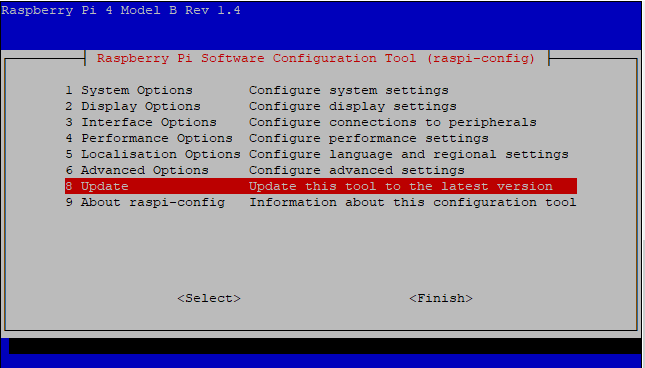

# Smart Mirror HW documentation 
-----------------------

Table of contents:
<!-- AUTO-GENERATED-CONTENT:START (TOC) -->
- [Raspberry Pi OS Setup](#raspberry-pi-os-setup)
  - [Pi Headless setup](#pi-headless-setup)
  - [Configure Pi OS settings on raspi-config menus](#configure-pi-os-settings-on-raspi-config-menus)
- [HW deployment and configuration](#hw-deployment-and-configuration)
  - [Neopixel LED Strip and RaspBerry Pi](#neopixel-led-strip-and-raspberry-pi)
  - [Connecting Led Strip to Mirror](#connecting-led-strip-to-mirror)
<!-- AUTO-GENERATED-CONTENT:END -->

## Raspberry Pi OS Setup

Download and install Raspberry Pi OS as instructed in [Pi Getting Started](https://www.raspberrypi.com/documentation/computers/getting-started.html) documentation.

> **_NOTE:_** *Update 12-Nov-2021*: Latest Raspberry Pi OS Released: 2021-10-31 has issues with BT Setup and dependencies - and will NOT work as Alexa Gaget. So please use different image version.

> Validated image that is working with Smart Mirror: 
https://downloads.raspberrypi.org/raspios_lite_armhf/images/raspios_lite_armhf-2021-05-28/2021-05-07-raspios-buster-armhf-lite.zip

To deploy specific image download it to your workstation and in Raspberry Pi imager choose "Use custom option" for Operating System with image you downloaded to your workstation. See image below where we are using **2021-05-07-raspios-buster-armhf-lite.zip**:


TLDR; Install Raspberry Pi OS
* Install Working Version (see Note above) of Raspberry Pi Imager for your OS
* Select "Raspberry Pi OS (other))
* Install **Pi OS Lite**

Steps overview:

Use Raspberry Pi Imager to deploy “Pi OS Lite (32-bit) - below is for Windows app but perform as instructed for your OS of choise


Write OS image "PI OS LITE (32-BIT)" to your sd-card (Please see Note above for working image).


### Pi Headless setup

To make setup a bit easier perform following to enable headless setup

1. Place a file with name “ssh” on the created SD (boot volume) card (no extension or content)

2. Create file with name “wpa_supplicant.conf” on the created SD (boot volume) card with the following content (adjust with your wifi ssid/password/country)
   
```
country=US
ctrl_interface=DIR=/var/run/wpa_supplicant GROUP=netdev
update_config=1

network={
    ssid="NETWORK-NAME"
    psk="NETWORK-PASSWORD"
}
```

Boot up (give it some time) then log on with default user is **pi** with a password of **raspberry** - change immediately :)

login: pi/raspberry

(Not writing down "pi@raspberry:~ $" prompt to make it easier to copy the commands)

```
sudo raspi-config
```

### Configure Pi OS settings on raspi-config menus

> Tip: Enter selects - Esc backs out - Tab and Arrow keys move between menus

Example screenshot:




Update Tool through menu 8 (validates network connectivity)

    8 Update

Set Password and Hostname from Menu 1 "System Options"

    1 System Options

→ S3 Password

→ S4 Hostname 

> **_NOTE:_** Recommendation is to use "smart-mirror" as host name. Or then use same host name you use here also with SSM Parameter store parameters - and every time Raspberry Pi hostname is referenced

Update - as needed based on your location:

    5 Localization options

→ L2 Timezone

→ L3 Keyboard

Select “Finish” (use Tab to select) 
> **NO NEED** to reboot if asked - reboot will come after updates

Update Pi OS Software components and install some dependencies:

```
sudo apt update -y && sudo apt full-upgrade -y
sudo apt install bluetooth libbluetooth-dev libudev-dev python-bluez bluez-hcidump python3-dbus python3-pip libusb-dev libdbus-1-dev libglib2.0-dev libical-dev libreadline-dev python3 -y
```
Reboot Raspberry Pi after setup and updating is done

```
sudo reboot
```

>Validate system comes up and hostname is one you set. After this you are ready to proceed AWS deployment - if you did not use smart-mirror as hostname remember to set it accordingly also in SSM parameter store!


> NOTE: It is recommended to further harden the setup and use e.g. SSH keys for SSH authentication instead of just password - see related raspberry pi documentation. 

## HW deployment and configuration

### Neopixel LED Strip and RaspBerry Pi

See [Neopixel uberguide](https://learn.adafruit.com/adafruit-neopixel-uberguide/basic-connections) for detailed instructions and explanations.

Connectivity diagram For Smart Mirror and Raspberry Pi4:


### Connecting Led Strip to Mirror

Attach led strip to your mirror so that `LED 0` is on 12 o clock - to make it simpler to show... a clock :)


Electronics connection under test bench


More finalized setup connecting to Smart Mirror


