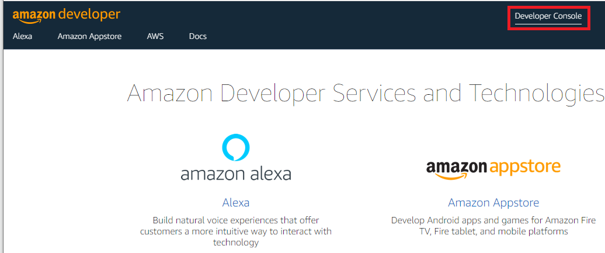
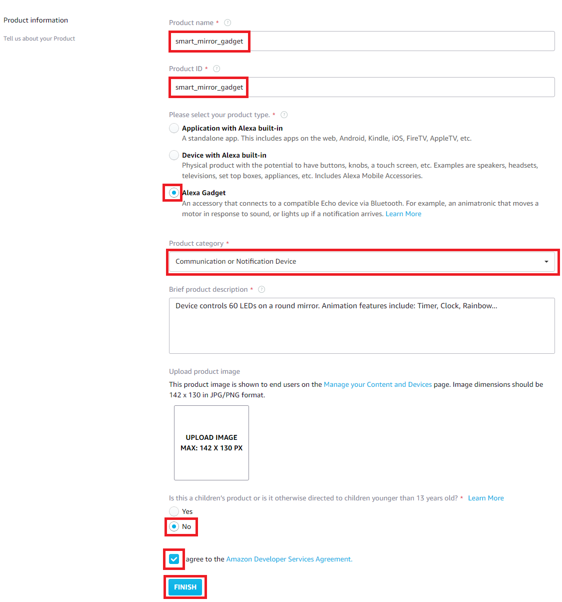

# Instructions for Smart Mirror deployment
-----------------------

Table of contents:
<!-- AUTO-GENERATED-CONTENT:START (TOC) -->
- [Deploy Smart Mirror AWS cloud components](#deploy-smart-mirror-aws-cloud-components)
  - [Create AWS CodeStar project](#create-aws-codestar-project)
  - [Enable AWS Cloud9 IDE](#enable-aws-cloud9-ide)
  - [Get Smart Mirror code in your AWS CodeDeploy repository](#get-smart-mirror-code-in-your-aws-codedeploy-repository)
- [Deploy AWS Cloudformation Stacks](#deploy-aws-cloudformation-stacks)
  - [Execute AWS CloudFormation to Create AWS SSM Association](#execute-aws-cloudformation-to-create-aws-ssm-association)
  - [Execute AWS CloudFormation to create Service Role for smart-mirror device](#execute-aws-cloudformation-to-create-service-role-for-smart-mirror-device)
  - [Create an Hybrid Activation in AWS Systems Manager](#create-an-hybrid-activation-in-aws-systems-manager)
- [Validate skill in Amazon developer console and create product](#validate-skill-in-amazon-developer-console-and-create-product)
- [Check skill on your Alexa App (in your phone)](#check-skill-on-your-alexa-app-in-your-phone)
- [Add Smart Mirror New Product in amazon developer console](#add-smart-mirror-new-product-in-amazon-developer-console)
  - [Execute AWS CloudFormation to create Parameter Store Parameters for Smart Mirror](#execute-aws-cloudformation-to-create-parameter-store-parameters-for-smart-mirror)
- [Configure Systems Manager Agent for your Raspberry Pi](#configure-systems-manager-agent-for-your-raspberry-pi)
  - [Validate you can see new host in the AWS Systems Manager Fleet Manager (in AWS Console)](#validate-you-can-see-new-host-in-the-aws-systems-manager-fleet-manager-in-aws-console)
  - [After Instance is registered add Tags](#after-instance-is-registered-add-tags)
- [Add Deployment step for Raspberry Pi in the CodePipeline - in AWS Console](#add-deployment-step-for-raspberry-pi-in-the-codepipeline---in-aws-console)
  - [Open AWS CodeDeploy Console](#open-aws-codedeploy-console)
- [Open AWS CodeStar smart-mirror project and edit the smart-mirror-pipeline (Through AWS Codepipeline or CodeStar service):](#open-aws-codestar-smart-mirror-project-and-edit-the-smart-mirror-pipeline-through-aws-codepipeline-or-codestar-service)
- [Configure Alexa Gadget in Raspberry Pi and BT pairing with Echo](#configure-alexa-gadget-in-raspberry-pi-and-bt-pairing-with-echo)
<!-- AUTO-GENERATED-CONTENT:END -->

Deploy Smart Mirror components and functionality - high level steps:

1. Set up CI/CD pipeline and example Alexa skill (AWS CodeStar)
2. Connect AWS and Alexa Developer Accounts
3. Work with AWS Cloud9 IDE - and deploy Smart Mirror Example code to your repository
4. Add necessary AWS Roles and policies (CloudFormation Templates)
5. Alexa Skill setup (In Amazon Developer Console)
    - Add Alexa Skill - and validate connectivity
    - Add Smart Mirror as Product toi Amazon Developer Console
6. Deploy Systems Manager Agent to Raspberry Pi - triggers automated CodeDeploy agent installation through Association
7. Create Application and Raspberry Pi Smart Mirror SW automated Deployment in AWS CodeDeploy
8. Configure Alexa Gadget and BT connectivity
9. Installation `DONE`
10. Verify, validate and start to add functionality

## Deploy Smart Mirror AWS cloud components

### Create AWS CodeStar project

> **_NOTE:_** See additional details Tutorial: [Create an Alexa Skill Project in AWS CodeStar](https://docs.aws.amazon.com/codestar/latest/userguide/alexa-tutorial.html)

Log in to your AWS Account with `Admin privileges` and open AWS Console. 

> **_NOTE:_** Validate that region is where you will deploy your smart mirror. In the examples we use Ireland (eu-west-1).

    Open AWS CodeStar Service (Through Search Bar - or browsing to service) 


    Select “Create Project” in AWS CodeStar


    Select “Create service role”


    Select Templates “Hello World Skill” Python Alexa Skill as project template → Select "Next"


    Fill in "Project name" to be "smart-mirror" this will also populate, "Project Id" and "Repository Name" for same value - select CodeCommit as repository - see screenshot below for details


    After this select “Connect Amazon developer account” you created for the project - fill in the credentials - "Confirm" OAuth request and "Allow" sign-in 


    "Allow" and connect account - or log in if not yet done - Select your "Vendor Account"


    Finally select "Next" - Review changes and execute selecting "Create project"

> **_NOTE:_**  Project takes few minutes to provision


After a while you have AWS CodeStar project available:

* Repository
* Pipeline
* Other Project Resources

### Enable AWS Cloud9 IDE

> **_NOTE:_**  We will use **AWS Cloud9 IDE** - other IDE is also possible and instructed under IDE - or you can use your existing developer machine. See more details about Cloud9 in [Cloud9 Tutorial](https://docs.aws.amazon.com/cloud9/latest/user-guide/tutorial.html)

    Select "Set up AWS Cloud9" - in AWS CodeStart Overview -tab


Fill in details for Cloud9 - see example in below picture:

> **_NOTE:_** You can use **default** VPC and subnets (Or if you have specific requirements change accordingly)


    Select "Create Environment"

Environment creation takes some minutes - and is visible only after environment is created - refresh page to get visibility.


After IDE is ready you can open it from AWS CodeStar “Open IDE” button


You now directly have access to sample repository deployed by CodeStar (python example) in IDE. 
To make it easier to work with IDE clean up Welcome pages and make terminal bigger - see screenshot above

> There is now IDE in place to work with smart-mirror code

### Get Smart Mirror code in your AWS CodeDeploy repository

Copy `smart-mirror.zip` from `smart-mirror-mvp` folder to IDE / repository (you can clone the repo there or use other method of your choice)

Browse to /environment folder on your Cloud 9 IDE Terminal and unzip the "smart-mirror.zip" containing source code for smart mirror - overwriting sample code currently in repository. 

To upload files to Cloud9, either drag a local file directly from your desktop into the Cloud9 file tree (in `environment` folder), or use the File > Upload Local Files menu item

Before pushing you can also configure your git username and password (git config) as per instructions in Cloud9 console.

The default name for the skill that will be created when you push the code is currently "smart mirror a.k.a. unicorn". If you want to change that name you can change it using Cloud9 by editing the name property in `skill.json`.

Screenshot from extraction:


Commands to unzip the file in Cloud9 IDE terminal:
```
cd ~/environment/
unzip -o smart-mirror.zip
cd smart-mirror
git add .
git commit -m “First Push”
git push
```

If you view AWS CodePipeline service (or Pipeline in CodeStar) in AWS console you can see AWS CodePipeline building sample pipeline with smart-mirror code. 

`CI/CD in Action!`


## Deploy AWS Cloudformation Stacks

> **_NOTE:_**  Use region where you deployed. In Examples we use eu-west-1 (Ireland)

> Additional documentation on CloudFormation CLI: https://docs.aws.amazon.com/AWSCloudFormation/latest/UserGuide/cfn-using-cli.html

### Execute AWS CloudFormation to Create AWS SSM Association

Create AWS SSM association with AWS CloudFormation using AWS CLI in Cloud9 IDE with configuration file `CodeDeployAssociation.yaml` as template body.

Access AWS Cloud9 IDE you created before and there open terminal and browse to `~/environment/smart-mirror/cloudformation-templates` folder and execute cloudformation CLI.

Create Stack with commands:

```
cd ~/environment/smart-mirror/cloudformation-templates/
aws cloudformation create-stack --stack-name SmartMirrorAssociation --template-body file://./CodeDeployAssociation.yaml
```

Screenshot:


### Execute AWS CloudFormation to create Service Role for smart-mirror device

Create AWS SSM association with AWS CloudFormation using AWS CLI in Cloud9 IDE with configuration file `SmartMirrorDeviceRole.yaml` as template body.

Access AWS Cloud9 IDE you created before and there open terminal and browse to `~/environment/smart-mirror/cloudformation-templates` folder and execute cloudformation CLI.

Create Stack with commands:

```
cd ~/environment/smart-mirror/cloudformation-templates/
aws cloudformation create-stack --stack-name SmartMirrorDeviceRole --template-body file://./SmartMirrorDeviceRole.yaml --capabilities CAPABILITY_NAMED_IAM
```

Screenshot:


### Create an Hybrid Activation in AWS Systems Manager

Open AWS Systems Manager Service and select “Hybrid Activations” under Node Management in left pane
Select “Create an Activation”


Change activation description - and name as in below screenshot

> **_NOTE:_** Activation default expiration is 24 hours - so make sure use it during the window or adjust "Activation expiry date" accordingly

Be sure to use `SmartMirrorDeviceRole` you Created earlier in this procedure (by deploying the CloudFormation stack)


    Fill in as above and Select "Create activation"

> **_NOTE:_** Copy down the details (Activation ID and Code) in safe place!


    Activation Code = <your value - record to safe place>
    Activation ID   = <your value - record to safe place>


## Validate skill in Amazon developer console and create product
Open [Amazon Developer Services](https://developer.amazon.com/) 

    Open Developer Console from top right


    Open Alexa / Alexa Skills Kit


In Alexa Console you have a skill (created by Smart Mirror code). Skill name is by default "smart mirror a.k.a. unicorn" unless you have changed it before pushing the code.


    Enable Development mode (under Test menu)


Test the skill with your invocation word (Find this in sample code skill.json - below we use racecar - default is unicorn).


> **_NOTE:_**  No need to worry about "Smart mirror not found" - HW is not configured or connected yet :)

## Check skill on your Alexa App (in your phone) 

    Open Alexa app in mobile: More → Skills & Games → Choose "Dev"

You should see your skill there provided you are on right account (in below skill is named "mirror test")


> **_NOTE:_** Make sure the account you are using is the same account you use in your device


## Add Smart Mirror New Product in amazon developer console

Open Amazon [Developer Console](https://developer.amazon.com/)

See additional details in [Alexa Gadgets Raspberry](https://github.com/alexa-samples/Alexa-Gadgets-Raspberry-Pi-Samples#registering-a-gadget-in-the-alexa-voice-service-developer-console) repository (You don't need to follow those instructions. Instructions below are sufficient)


    Select "Developer Console" (top right)



    Open Alexa / Alexa Voice Service 


    Select "Manage Your Products"


    Select "Add New Product"


Fill in as in example below



And in the end of page press "FINISH"

Select “Edit“ your product (three dots next to name) just created and write down to safe place: 

    Amazon ID = <your value>
    Alexa Gadget Secret =  <your value>

> **_NOTE:_**  You will need above those when creating parameters for your device

### Execute AWS CloudFormation to create Parameter Store Parameters for Smart Mirror

Open AWS CloudFormation console and use configuration file `ParameterStore.yaml` from IDE / "cloudformation-template" folder in AWS Console as Admin user

Select `Create Stack` : With new resources(standard)
    


    Choose: "Template is ready" and "Upload a template file"

    Browse to location that has "ParameterStore.yaml" (in IDE "cloudformation-templates" folder) and press "Next"


Fill in parameters as below example **WITH YOUR OWN ID**’s and details 

- Stack-name: smart-mirror-parameters (descriptive name for stack)
- AlexaGadgetSecret: One you created in Alexa developer console
- AmazonId: One you created in Alexa developer console
- DeviceName: Hostname you gave to your raspberry Pi (recommendation use smart-mirror as hostname - it is also the default)
- LedCount: LED Count in your strip (should be 60)
- LedGPIO: GPIO Pin used in your RaspBerry Pi (21 for Raspberry Pi 4)
- LedType: Type of your Strip


    Enter Stack Name "SmartMirrorDeviceRole" and press "Next"

    On next screen leave defaults and press "Next"

    In Final screen Acknowledge Changes if asked and select "Create Stack"


## Configure Systems Manager Agent for your Raspberry Pi

Log in with SSH to your Raspberry Pi (as pi user)

Run following commands to install amazon-ssm-agent - include quotation marks in command as below for Activation Code and ID

> **_NOTE:_** use **Activation Code** and  **Activation ID** you created in SSM Hybrid Activation 

> **_NOTE:_** Use region where you deployed your CodeStar - in example below we use eu-west-1 (Ireland)

```
wget https://s3.eu-west-1.amazonaws.com/amazon-ssm-eu-west-1/latest/debian_arm/amazon-ssm-agent.deb
sudo dpkg -i amazon-ssm-agent.deb
sudo service amazon-ssm-agent stop
sudo amazon-ssm-agent -register -code "Activation Code" -id "Activation ID" -region "eu-west-1"
sudo service amazon-ssm-agent start
```

### Validate you can see new host in the AWS Systems Manager Fleet Manager (in AWS Console)

Log in to AWS account as Admin user and open Systems Manager - Fleet Manager 

> **_NOTE:_** Make sure region is one you deployed - we use Ireland (eu-west-1) in our example


### After Instance is registered add Tags

    Select instance on above list and in Tags -Tab - Add Tags as below. Remember to "Save".

> **_NOTE:_** Tags are case sensitive!

- Name: smart-mirror (hostname of your raspberryPi device)
- project: smart-mirror

   Select "Save"


This will trigger automatic association and deploys dependencies and code deploy agent in your Raspberry Pi

After a while (up to 5 minutes) Raspberry PI should have association in place

You can check the status in the SSM / Instance / Associations:


Other place to see progress is in State Manager (In AWS Systems Manager)

After this is successful you see Association Status “Success”:


## Add Deployment step for Raspberry Pi in the CodePipeline - in AWS Console

Log in to AWS account as Admin user - make sure region is where you deployed. We use Ireland (eu-west-1)

Open AWS IAM Service and add following policies to `CodeStarWorker-smart-mirror-CodeDeploy` **Role**

Add AWSCodeDeployRole and AWSCodeDeployFullAccess policies to "CodeStarWorker-smart-mirror-CodeDeploy" role. 
Select "Attach policies" and add policies as in picture below


### Open AWS CodeDeploy Console

Browse to Applications - Create Application


    Fill in as below and press "Create Application"


    Next Select "Create Deployment Group"

Fill in details as below screenshots


Add Tag Group project smart-mirror


>Note Remove "Enable Load Balancing" selector


After inputting values select “Create Deployment Group”

## Open AWS CodeStar smart-mirror project and edit the smart-mirror-pipeline (Through AWS Codepipeline or CodeStar service):


    Press “Edit”
    


    Select “+ Add stage” after "Source"


Stage name "DeployToDevice"

    Select "Add Stage"

Select "+ Add Action Group" in `DeployToDevice` stage you created


    
Action Name: DeployToDevice

Other values as in below screenshot (Region value one you used to deploy!)


    Press “Done“


    "Save" your changes


    Finally press “Release change” to deploy to your Raspberry Pi


    This starts deployment   


## Configure Alexa Gadget in Raspberry Pi and BT pairing with Echo

> See additional information in https://github.com/alexa-samples/Alexa-Gadgets-Raspberry-Pi-Samples#installation

Log in to your Raspberry Pi as pi user.

> **_NOTE:_** You can ignore errors like below:

```
tools/rctest.c: In function ‘recv_mode’:
tools/rctest.c:507:19: error: ‘SIOCGSTAMP’ undeclared (first use in this function); did you mean ‘SIOCGRARP’?
     if (ioctl(sk, SIOCGSTAMP, &tv) < 0) {`
```

Run following commands as pi user:
```
sudo systemctl stop smart-mirror
cd /home/smart-mirror/script
sudo python3 setup_gadget.py --setup
```

This will setup the Alexa Gadget side in your Raspberry Pi

“AGREE” with the terms when prompted
    
    > The Alexa Gadgets Raspberry Pi launch script provided herein will retrieve the 'Bluez-5.50' package at install-time from third-party sources. There are terms and conditions that you need to agree to abide by if you choose to install the 'Bluez-5.50' package (https://git.kernel.org/pub/scm/bluetooth/bluez.git/tree/COPYING?h=5.50). This script will also enable you to modify and install the 'bluez-5.50' package to enable notification callbacks after reconnections to a paired Echo device. This is required for communication between your gadget and the Echo device over BLE. If you do not agree with every term and condition associated with 'Bluez-5.50', enter 'QUIT', else enter '**AGREE**'.
    
Type **`AGREE`**

“Which transport mode would you like to configure your gadget for (ble/bt)?”

Type `bt` 

Restart smart-mirror service after setup is finished

```
sudo systemctl start smart-mirror
```

Device is now in pairing more →  Go and pair your Alexa Gadget with your Echo device (Bluetooth).

See additional details in 
[Pair and Connect a Gadget to an Echo Device Over Classic Bluetooth](https://developer.amazon.com/en-US/docs/alexa/alexa-gadgets-toolkit/classic-bluetooth-pair-connect.html)

**`DONE! Happy Mirroring - you now have MVP product installed and you can continue to add functionality through challenges!`**
